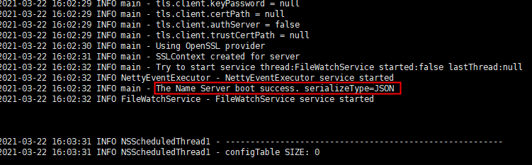
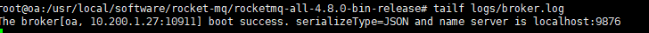
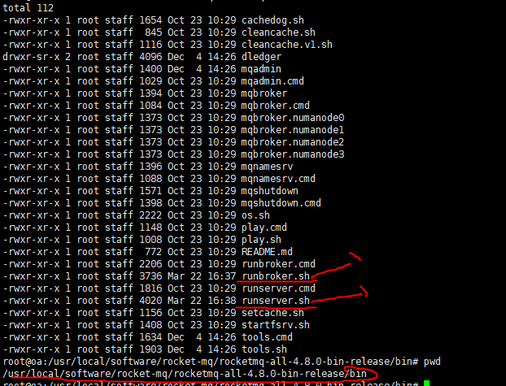
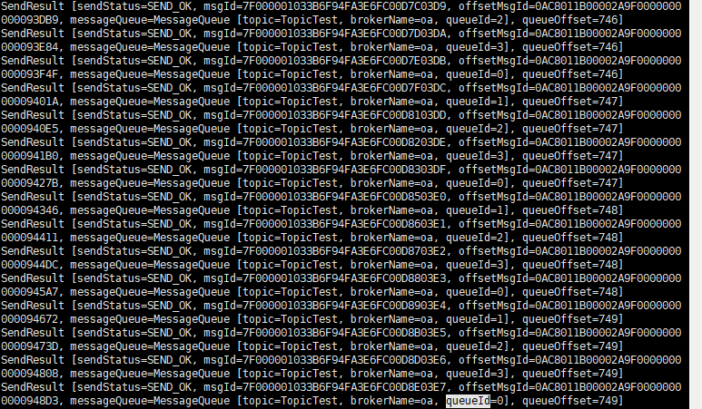
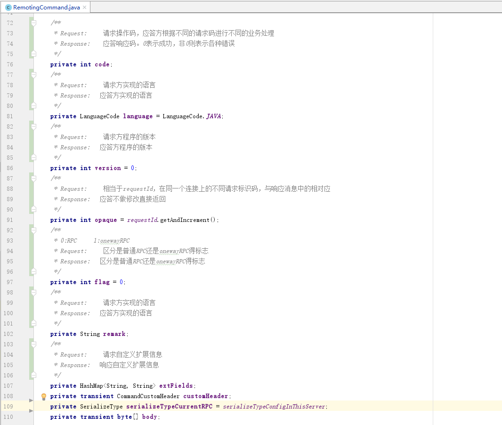
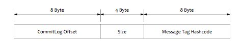
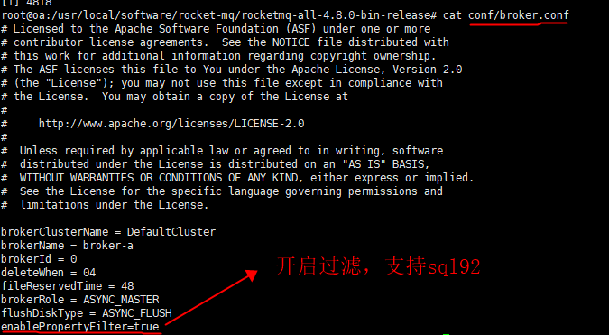

# Rocket-MQ

## 1. 安装

1. 64位操作系统，Linux
2. jdk 1.8+

### 开启name服务

[rocketmq-all-4.8.0-bin-release.zip](./accessory/rocketmq-all-4.8.0-bin-release.zip)

```shell
#解压
unzip rocketmq-all-4.8.0-bin-release.zip 
cd rocketmq-all-4.8.0-bin-release
#开启名称服务器
nohup sh bin/mqnamesrv >./logs/namesrv.log 2>1 &
tailf logs/namesrv.log
```



### 开启broker服务

```shell
#开启broker
nohup sh bin/mqbroker -n localhost:9876 -c conf/broker.conf >./logs/broker.log 2>1 &
tailf logs/broker.log 
```



### 内存不足解决方案

**如果遇到虚拟机启动不了：内存不够**，则需要重新设置启动参数，namesrv默认4g,broker默认8g，

修改bin目录中的两个文件。



### 发送和接收消息

```shell
#临时设置环境变量，下面类中需要用到
export NAMESRV_ADDR=localhost:9876
#开启生产者发送消息
sh bin/tools.sh org.apache.rocketmq.example.quickstart.Producer
#开启消费者消费消息
sh bin/tools.sh org.apache.rocketmq.example.quickstart.Consumer
```

**生产者**



 **消费者**

​                           

### 关闭服务器

```shell
sh bin/mqshutdown broker
sh bin/mqshutdown namesrv
```

## 2. 介绍

[Apache RocketMQ开发者指南](https://github.com/apache/rocketmq/tree/master/docs/cn#apache-rocketmq%E5%BC%80%E5%8F%91%E8%80%85%E6%8C%87%E5%8D%97)

### 2.1 概念与特性

#### 2.1.1 概念

##### 1 消息模型（Message Model）

RocketMQ主要由 Producer、Broker、Consumer 三部分组成，其中Producer 负责生产消息，Consumer 负责消费消息，Broker 负责存储消息。Broker 在实际部署过程中对应一台服务器，每个 Broker 可以存储多个Topic的消息，每个Topic的消息也可以分片存储于不同的 Broker。Message Queue 用于存储消息的物理地址，每个Topic中的消息地址存储于多个 Message Queue 中。ConsumerGroup 由多个Consumer 实例构成。

##### 2 消息生产者（Producer）

负责生产消息，一般由业务系统负责生产消息。一个消息生产者会把业务应用系统里产生的消息发送到broker服务器。RocketMQ提供多种发送方式，同步发送、异步发送、顺序发送、单向发送。同步和异步方式均需要Broker返回确认信息，单向发送不需要。

##### 3 消息消费者（Consumer）

负责消费消息，一般是后台系统负责异步消费。一个消息消费者会从Broker服务器拉取消息、并将其提供给应用程序。从用户应用的角度而言提供了两种消费形式：拉取式消费、推动式消费。

##### 4 主题（Topic）

表示一类消息的集合，每个主题包含若干条消息，每条消息只能属于一个主题，是RocketMQ进行消息订阅的基本单位。

##### 5 代理服务器（Broker Server）

消息中转角色，负责存储消息、转发消息。代理服务器在RocketMQ系统中负责接收从生产者发送来的消息并存储、同时为消费者的拉取请求作准备。代理服务器也存储消息相关的元数据，包括消费者组、消费进度偏移和主题和队列消息等。

##### 6 名字服务（Name Server）

名称服务充当路由消息的提供者。生产者或消费者能够通过名字服务查找各主题相应的Broker IP列表。多个Namesrv实例组成集群，但相互独立，没有信息交换。

##### 7 拉取式消费（Pull Consumer）

Consumer消费的一种类型，应用通常主动调用Consumer的拉消息方法从Broker服务器拉消息、主动权由应用控制。一旦获取了批量消息，应用就会启动消费过程。

##### 8 推动式消费（Push Consumer）

Consumer消费的一种类型，该模式下Broker收到数据后会主动推送给消费端，该消费模式一般实时性较高。

##### 9 生产者组（Producer Group）

同一类Producer的集合，这类Producer发送同一类消息且发送逻辑一致。如果发送的是事务消息且原始生产者在发送之后崩溃，则Broker服务器会联系同一生产者组的其他生产者实例以提交或回溯消费。

##### 10 消费者组（Consumer Group）

同一类Consumer的集合，这类Consumer通常消费同一类消息且消费逻辑一致。消费者组使得在消息消费方面，实现负载均衡和容错的目标变得非常容易。要注意的是，消费者组的消费者实例必须订阅完全相同的Topic。RocketMQ 支持两种消息模式：集群消费（Clustering）和广播消费（Broadcasting）。

##### 11 集群消费（Clustering）

集群消费模式下,相同Consumer Group的每个Consumer实例平均分摊消息。

##### 12 广播消费（Broadcasting）

广播消费模式下，相同Consumer Group的每个Consumer实例都接收全量的消息。

##### 13 普通顺序消息（Normal Ordered Message）

普通顺序消费模式下，消费者通过同一个消费队列收到的消息是有顺序的，不同消息队列收到的消息则可能是无顺序的。

##### 14 严格顺序消息（Strictly Ordered Message）

严格顺序消息模式下，消费者收到的所有消息均是有顺序的。

##### 15 消息（Message）

消息系统所传输信息的物理载体，生产和消费数据的最小单位，每条消息必须属于一个主题。RocketMQ中每个消息拥有唯一的Message ID，且可以携带具有业务标识的Key。系统提供了通过Message ID和Key查询消息的功能。

##### 16 标签（Tag）

为消息设置的标志，用于同一主题下区分不同类型的消息。来自同一业务单元的消息，可以根据不同业务目的在同一主题下设置不同标签。标签能够有效地保持代码的清晰度和连贯性，并优化RocketMQ提供的查询系统。消费者可以根据Tag实现对不同子主题的不同消费逻辑，实现更好的扩展性。

### 2.1.2 特性

##### 1 订阅与发布

消息的发布是指某个生产者向某个topic发送消息；消息的订阅是指某个消费者关注了某个topic中带有某些tag的消息，进而从该topic消费数据。

##### 2 消息顺序

消息有序指的是一类消息消费时，能按照发送的顺序来消费。例如：一个订单产生了三条消息分别是订单创建、订单付款、订单完成。消费时要按照这个顺序消费才能有意义，但是同时订单之间是可以并行消费的。RocketMQ可以严格的保证消息有序。

顺序消息分为全局顺序消息与分区顺序消息，全局顺序是指某个Topic下的所有消息都要保证顺序；部分顺序消息只要保证每一组消息被顺序消费即可。

- 全局顺序 对于指定的一个 Topic，所有消息按照严格的先入先出（FIFO）的顺序进行发布和消费。 适用场景：性能要求不高，所有的消息严格按照 FIFO 原则进行消息发布和消费的场景
- 分区顺序 对于指定的一个 Topic，所有消息根据 sharding key 进行区块分区。 同一个分区内的消息按照严格的 FIFO 顺序进行发布和消费。 Sharding key 是顺序消息中用来区分不同分区的关键字段，和普通消息的 Key 是完全不同的概念。 适用场景：性能要求高，以 sharding key 作为分区字段，在同一个区块中严格的按照 FIFO 原则进行消息发布和消费的场景。

##### 3 消息过滤

RocketMQ的消费者可以根据Tag进行消息过滤，也支持自定义属性过滤。消息过滤目前是在Broker端实现的，优点是减少了对于Consumer无用消息的网络传输，缺点是增加了Broker的负担、而且实现相对复杂。

##### 4 消息可靠性

RocketMQ支持消息的高可靠，影响消息可靠性的几种情况：

1. Broker非正常关闭
2. Broker异常Crash
3. OS Crash
4. 机器掉电，但是能立即恢复供电情况
5. 机器无法开机（可能是cpu、主板、内存等关键设备损坏）
6. 磁盘设备损坏

1)、2)、3)、4) 四种情况都属于硬件资源可立即恢复情况，RocketMQ在这四种情况下能保证消息不丢，或者丢失少量数据（依赖刷盘方式是同步还是异步）。

5)、6)属于单点故障，且无法恢复，一旦发生，在此单点上的消息全部丢失。RocketMQ在这两种情况下，通过异步复制，可保证99%的消息不丢，但是仍然会有极少量的消息可能丢失。通过同步双写技术可以完全避免单点，同步双写势必会影响性能，适合对消息可靠性要求极高的场合，例如与Money相关的应用。注：RocketMQ从3.0版本开始支持同步双写。

##### 5 至少一次

至少一次(At least Once)指每个消息必须投递一次。Consumer先Pull消息到本地，消费完成后，才向服务器返回ack，如果没有消费一定不会ack消息，所以RocketMQ可以很好的支持此特性。

##### 6 回溯消费

回溯消费是指Consumer已经消费成功的消息，由于业务上需求需要重新消费，要支持此功能，Broker在向Consumer投递成功消息后，消息仍然需要保留。并且重新消费一般是按照时间维度，例如由于Consumer系统故障，恢复后需要重新消费1小时前的数据，那么Broker要提供一种机制，可以按照时间维度来回退消费进度。RocketMQ支持按照时间回溯消费，时间维度精确到毫秒。

##### 7 事务消息

RocketMQ事务消息（Transactional Message）是指应用本地事务和发送消息操作可以被定义到全局事务中，要么同时成功，要么同时失败。RocketMQ的事务消息提供类似 X/Open XA 的分布事务功能，通过事务消息能达到分布式事务的最终一致。

##### 8 定时消息

定时消息（延迟队列）是指消息发送到broker后，不会立即被消费，等待特定时间投递给真正的topic。 broker有配置项messageDelayLevel，默认值为“1s 5s 10s 30s 1m 2m 3m 4m 5m 6m 7m 8m 9m 10m 20m 30m 1h 2h”，18个level。可以配置自定义messageDelayLevel。注意，messageDelayLevel是broker的属性，不属于某个topic。发消息时，设置delayLevel等级即可：msg.setDelayLevel(level)。level有以下三种情况：

- level == 0，消息为非延迟消息
- 1<=level<=maxLevel，消息延迟特定时间，例如level==1，延迟1s
- level > maxLevel，则level== maxLevel，例如level==20，延迟2h

定时消息会暂存在名为SCHEDULE_TOPIC_XXXX的topic中，并根据delayTimeLevel存入特定的queue，queueId = delayTimeLevel – 1，即一个queue只存相同延迟的消息，保证具有相同发送延迟的消息能够顺序消费。broker会调度地消费SCHEDULE_TOPIC_XXXX，将消息写入真实的topic。

需要注意的是，定时消息会在第一次写入和调度写入真实topic时都会计数，因此发送数量、tps都会变高。

##### 9 消息重试

Consumer消费消息失败后，要提供一种重试机制，令消息再消费一次。Consumer消费消息失败通常可以认为有以下几种情况：

- 由于消息本身的原因，例如反序列化失败，消息数据本身无法处理（例如话费充值，当前消息的手机号被注销，无法充值）等。这种错误通常需要跳过这条消息，再消费其它消息，而这条失败的消息即使立刻重试消费，99%也不成功，所以最好提供一种定时重试机制，即过10秒后再重试。
- 由于依赖的下游应用服务不可用，例如db连接不可用，外系统网络不可达等。遇到这种错误，即使跳过当前失败的消息，消费其他消息同样也会报错。这种情况建议应用sleep 30s，再消费下一条消息，这样可以减轻Broker重试消息的压力。

RocketMQ会为每个消费组都设置一个Topic名称为“%RETRY%+consumerGroup”的重试队列（这里需要注意的是，这个Topic的重试队列是针对消费组，而不是针对每个Topic设置的），用于暂时保存因为各种异常而导致Consumer端无法消费的消息。考虑到异常恢复起来需要一些时间，会为重试队列设置多个重试级别，每个重试级别都有与之对应的重新投递延时，重试次数越多投递延时就越大。RocketMQ对于重试消息的处理是先保存至Topic名称为“SCHEDULE_TOPIC_XXXX”的延迟队列中，后台定时任务按照对应的时间进行Delay后重新保存至“%RETRY%+consumerGroup”的重试队列中。

##### 10 消息重投

生产者在发送消息时，同步消息失败会重投，异步消息有重试，oneway没有任何保证。消息重投保证消息尽可能发送成功、不丢失，但可能会造成消息重复，消息重复在RocketMQ中是无法避免的问题。消息重复在一般情况下不会发生，当出现消息量大、网络抖动，消息重复就会是大概率事件。另外，生产者主动重发、consumer负载变化也会导致重复消息。如下方法可以设置消息重试策略：

- retryTimesWhenSendFailed:同步发送失败重投次数，默认为2，因此生产者会最多尝试发送retryTimesWhenSendFailed + 1次。不会选择上次失败的broker，尝试向其他broker发送，最大程度保证消息不丢。超过重投次数，抛出异常，由客户端保证消息不丢。当出现RemotingException、MQClientException和部分MQBrokerException时会重投。
- retryTimesWhenSendAsyncFailed:异步发送失败重试次数，异步重试不会选择其他broker，仅在同一个broker上做重试，不保证消息不丢。
- retryAnotherBrokerWhenNotStoreOK:消息刷盘（主或备）超时或slave不可用（返回状态非SEND_OK），是否尝试发送到其他broker，默认false。十分重要消息可以开启。

##### 11 流量控制

生产者流控，因为broker处理能力达到瓶颈；消费者流控，因为消费能力达到瓶颈。

生产者流控：

- commitLog文件被锁时间超过osPageCacheBusyTimeOutMills时，参数默认为1000ms，返回流控。
- 如果开启transientStorePoolEnable == true，且broker为异步刷盘的主机，且transientStorePool中资源不足，拒绝当前send请求，返回流控。
- broker每隔10ms检查send请求队列头部请求的等待时间，如果超过waitTimeMillsInSendQueue，默认200ms，拒绝当前send请求，返回流控。
- broker通过拒绝send 请求方式实现流量控制。

注意，生产者流控，不会尝试消息重投。

消费者流控：

- 消费者本地缓存消息数超过pullThresholdForQueue时，默认1000。
- 消费者本地缓存消息大小超过pullThresholdSizeForQueue时，默认100MB。
- 消费者本地缓存消息跨度超过consumeConcurrentlyMaxSpan时，默认2000。

消费者流控的结果是降低拉取频率。

##### 12 死信队列

死信队列用于处理无法被正常消费的消息。当一条消息初次消费失败，消息队列会自动进行消息重试；达到最大重试次数后，若消费依然失败，则表明消费者在正常情况下无法正确地消费该消息，此时，消息队列 不会立刻将消息丢弃，而是将其发送到该消费者对应的特殊队列中。

RocketMQ将这种正常情况下无法被消费的消息称为死信消息（Dead-Letter Message），将存储死信消息的特殊队列称为死信队列（Dead-Letter Queue）。在RocketMQ中，可以通过使用console控制台对死信队列中的消息进行重发来使得消费者实例再次进行消费。


架构图：


### 2.2 消息存储

#### 2.2.1 消息存储整体架构

Broker 单个实例下 所有队列共用一个 CommitLog(日志数据文件)存储。producer 发送消息到 Broker，Broker 会采用同步或者异步的方式对消息进行刷盘持久化，保存进 CommitLog中。Consumer 消费消息通过ConsumeQueue【**consumequeue文件采取定长设计，每一个条目共20个字节，分别为8字节的commitlog物理偏移量、4字节的消息长度、8字节tag hashcode，单个文件由30W个条目组成，可以像数组一样随机访问每一个条目，每个ConsumeQueue文件大小约5.72M**】提高消费性能。消费端当无法拉取到消息时，可以等下一次消息拉取，同时服务端也支持长轮询模式，如果一个消息拉取请求未拉取到消息，Broker允许等待30s的时间，只要这段时间内有新消息到达，将直接返回给消费端。这里，Rocket MQ的具体做法是，使用Broker端的后台服务线程 — ReputMessageService 不停地分发请求并异步构建 ConsumeQueue（逻辑消费队列）和 IndexFile（索引文件）数据。

#### 2.2.2 页缓存与内存映射

页缓存（PageCache)是OS对文件的缓存，用于加速对文件的读写。一般来说，程序对文件进行顺序读写的速度几乎接近于内存的读写速度，主要原因就是由于OS使用PageCache机制对读写访问操作进行了性能优化，vh.6+t将一部分的内存用作PageCache。对于数据的写入，OS会先写入至Cache内，随后通过异步的方式由pdflush内核线程将Cache内的数据刷盘至物理磁盘上。对于数据的读取，如果一次读取文件时出现未命中PageCache的情况，OS从物理磁盘上访问读取文件的同时，会顺序对其他相邻块的数据文件进行预读取。

在RocketMQ中，ConsumeQueue逻辑消费队列存储的数据较少，并且是顺序读取，在page cache机制的预读取作用下，Consume Queue文件的读性能几乎接近读内存，即使在有消息堆积情况下也不会影响性能。而对于CommitLog消息存储的日志数据文件来说，读取消息内容时候会产生较多的随机访问读取，严重影响性能。如果选择合适的系统IO调度算法，比如设置调度算法为“Deadline”（此时块存储采用SSD的话），随机读的性能也会有所提升。

另外，RocketMQ主要通过MappedByteBuffer对文件进行读写操作。其中，利用了NIO中的FileChannel模型将磁盘上的物理文件直接映射到用户态的内存地址中（这种Mmap的方式:零拷贝技术），将对文件的操作转化为直接对内存地址进行操作，从而极大地提高了文件的读写效率（正因为需要使用内存映射机制，故RocketMQ的文件存储都使用定长结构来存储，方便一次将整个文件映射至内存）。

#### 2.2.3 消息刷盘

(1) 同步刷盘：只有在消息真正持久化至磁盘后RocketMQ的Broker端才会真正返回给Producer端一个成功的ACK响应。同步刷盘对MQ消息可靠性来说是一种不错的保障，但是性能上会有较大影响，一般适用于金融业务应用该模式较多。

(2) 异步刷盘：能够充分利用OS的PageCache的优势，只要消息写入PageCache即可将成功的ACK返回给Producer端。消息刷盘采用后台异步线程提交的方式进行，降低了读写延迟，提高了MQ的性能和吞吐量。

### 2.3 通信机制

RocketMQ消息队列集群主要包括NameServer、Broker(Master/Slave)、Producer、Consumer 4个角色，基本通讯流程如下：

1. Broker 启动后需要完成一次将自己注册到 NameServer 的操作，随后每隔30s定时向 NameServer 上报Topic 路由信息。
2. producer 发送消息会根据消息的Topic从本地缓存 TopicPublishInfoTable 获取路由信息。如果没有会拉取 NameServer 上的路由信息，并默认 每隔30s 向 NameServer 拉取一次路由信息。
3. producer 从路由信息中 选择一个 队列（MesageQueue）进行消息发送，Broker 作为消息的接受者接受消息并落盘存储。
4. Consumer 获取路由信息，再通过客户端的负载均衡之后，选择其中的某一个或某几个消息队列来拉取消息并进行消费。

从上面1）~3）中可以看出在消息生产者, Broker和NameServer之间都会发生通信（这里只说了MQ的部分通信），因此如何设计一个良好的网络通信模块在MQ中至关重要，它将决定RocketMQ集群整体的消息传输能力与最终的性能。

rocketmq-remoting 模块是 RocketMQ消息队列中负责网络通信的模块，它几乎被其他所有需要网络通信的模块（诸如rocketmq-client、rocketmq-broker、rocketmq-namesrv）所依赖和引用。为了实现客户端与服务器之间高效的数据请求与接收，RocketMQ消息队列自定义了通信协议并在Netty的基础之上扩展了通信模块


#### 2.3.1 协议设计与编解码

在Client和Server之间完成一次消息发送时，需要对发送的消息进行一个协议约定，因此就有必要自定义RocketMQ的消息协议。同时，为了高效地在网络中传输消息和对收到的消息读取，就需要对消息进行编解码。在RocketMQ中，**RemotingCommand** 这个类在消息传输过程中对所有数据内容的封装，不但包含了所有的数据结构，还包含了编码解码操作




可见传输内容主要可以分为以下4部分：

(1) 消息长度：总长度，四个字节存储，占用一个int类型；

(2) 序列化类型&消息头长度：同样占用一个int类型，第一个字节表示序列化类型，后面三个字节表示消息头长度；

(3) 消息头数据：经过序列化后的消息头数据；

(4) 消息主体数据：消息主体的二进制字节数据内容；

#### 2.3.2 消息的通信方式和流程

在RocketMQ消息队列中支持通信的方式主要有同步(sync)、异步(async)、单向(oneway)三种。其中“单向”通信模式相对简单，一般用在发送心跳包场景下，无需关注其Response。

#### 2.3.3 Reactor多线程设计

*理解一下*

### 2.3 消息过滤

RocketMQ分布式消息队列的消息过滤方式有别于其它MQ中间件，是在Consumer端订阅消息时再做消息过滤的。RocketMQ这么做是在于其Producer端写入消息和Consumer端订阅消息采用分离存储的机制来实现的，Consumer端订阅消息是需要通过ConsumeQueue这个消息消费的逻辑队列拿到一个索引，然后再从CommitLog里面读取真正的消息实体内容，所以说到底也是还绕不开其存储结构。其ConsumeQueue的存储结构如下，可以看到其中有8个字节存储的Message Tag的哈希值，基于Tag的消息过滤正式基于这个字段值的。



主要支持如下2种的过滤方式

#### 2.3.1 TAG

(1) Tag过滤方式：Consumer端在订阅消息时除了指定Topic还可以指定TAG，如果一个消息有多个TAG，可以用||分隔。其中，Consumer端会将这个订阅请求构建成一个 SubscriptionData，发送一个Pull消息的请求给Broker端。Broker端从RocketMQ的文件存储层—Store读取数据之前，会用这些数据先构建一个MessageFilter，然后传给Store。Store从 ConsumeQueue读取到一条记录后，会用它记录的消息tag hash值去做过滤，由于在**服务端**只是**根据hashcode**进行判断，**无法精确**对tag原始字符串进行**过滤**，故在消息**消费端**拉取到消息后，还需要对消息的原始**tag字符串**进行**比对**，如果不同，则丢弃该消息，不进行消息消费。

```cpp
DefaultMQPushConsumer consumer = new DefaultMQPushConsumer("test");
consumer.subscribe("TOPIC", "TAG1 || TAG2 || TAG3");
```

不过一条消息只能包含一个tag，无法处理复杂的场景，这个时候可以使用SQL92的过滤方式，实现一些有趣的过滤逻辑。

#### 2.3.2 SQL92

(2) SQL92的过滤方式：这种方式的大致做法和上面的Tag过滤方式一样，只是在Store层的具体过滤过程不太一样，真正的 SQL expression 的构建和执行由rocketmq-filter模块负责的。每次过滤都去执行SQL表达式会影响效率，所以RocketMQ使用了BloomFilter避免了每次都去执行。SQL92的表达式上下文为消息的属性。

[参考](https://www.jianshu.com/p/ef74f350e3bc)

```shell
sh bin/mqshutdown broker
sh bin/mqshutdown namesrv

#broker.conf中添加一下属性，并重启 broker  namesrv
enablePropertyFilter=true

nohup sh bin/mqnamesrv >./logs/namesrv.log 2>1 &
nohup sh bin/mqbroker -n localhost:9876 -c conf/broker.conf >./logs/broker.log 2>1 &

```




```java
//生产者
 Message msg = new Message("TopicTest",
                        "TagA"+i,
                        "OrderID188",
                        ("sql92过滤").getBytes(RemotingHelper.DEFAULT_CHARSET));
msg.putUserProperty("test",String.valueOf(i));

//消费者,去 tags为 TagA1,TagA2 并且自定义值test在[7,9]之间的消息
consumer.subscribe("TopicTest",MessageSelector.bySql("(TAGS is not null and TAGS in ('TagA1','TagA2')) " +
                "or (test is not null and test between 7 and 9)"));
```

### 2.4 负载均衡

都在 Client 端完成。

#### 2.4.1 Producer的负载均衡

Producer端在发送消息的时候，会先根据Topic找到指定的TopicPublishInfo，在获取了TopicPublishInfo路由信息后，RocketMQ的客户端在默认方式下selectOneMessageQueue()方法会从TopicPublishInfo中的messageQueueList中选择一个队列（MessageQueue）进行发送消息。具体的容错策略均在MQFaultStrategy这个类中定义。这里有一个sendLatencyFaultEnable开关变量，如果开启，在随机递增取模的基础上，再过滤掉not available的Broker代理。所谓的"latencyFaultTolerance"，是指对之前失败的，按一定的时间做退避。例如，如果上次请求的latency超过550Lms，就退避3000Lms；超过1000L，就退避60000L；如果关闭，采用随机递增取模的方式选择一个队列（MessageQueue）来发送消息，latencyFaultTolerance机制是实现消息发送高可用的核心关键所在。

```java
//发送消息DefaultMQProducerImpl.sendDefaultImpl()
private SendResult sendDefaultImpl()(
        Message msg,
        final CommunicationMode communicationMode,
        final SendCallback sendCallback,
        final long timeout
    ) throws MQClientException, RemotingException, MQBrokerException, InterruptedException {
        this.makeSureStateOK();
        //检查消息的topic是否符合规则（正则，长度127），是否使用了初始化的 TopicValidator.NOT_ALLOWED_SEND_TOPIC_SET
        //检查消息的body是否符合规则（默认最大4M）
        Validators.checkMessage(msg, this.defaultMQProducer);
    ...
        //根据 Topic 找到指定的 TopicPublishInfo
        TopicPublishInfo topicPublishInfo = this.tryToFindTopicPublishInfo(msg.getTopic());
        if (topicPublishInfo != null && topicPublishInfo.ok()) {
            boolean callTimeout = false;
            MessageQueue mq = null;
            Exception exception = null;
            SendResult sendResult = null;
            //重试次数，只在同步时生效
            int timesTotal = communicationMode == CommunicationMode.SYNC ? 1 + this.defaultMQProducer.getRetryTimesWhenSendFailed() : 1;
            int times = 0;
            String[] brokersSent = new String[timesTotal];
            for (; times < timesTotal; times++) {
                String lastBrokerName = null == mq ? null : mq.getBrokerName();
                //选择一个队列进行发送消息，具体的容错策略均在 MQFaultStrategy 这个类中定义[随机递增取模]
                MessageQueue mqSelected = this.selectOneMessageQueue(topicPublishInfo, lastBrokerName);
...
                        //发送消息
                        sendResult = this.sendKernelImpl(msg, mq, communicationMode, sendCallback, topicPublishInfo, timeout - costTime);
...
}

//容错策略类
public class MQFaultStrategy {
    private final static InternalLogger log = ClientLogger.getLog();
    /**
     * latencyFaultTolerance 是指对之前失败的，按一定的时间做退避。例如，如果上次请求的latency超过550Lms，就退避3000Lms；超过1000L，就退避60000L；
     * 如果关闭，采用随机递增取模的方式选择一个队列（MessageQueue）来发送消息，latencyFaultTolerance机制是实现消息发送高可用的核心关键所在。
     */
    private final LatencyFaultTolerance<String> latencyFaultTolerance = new LatencyFaultToleranceImpl();

    /**
     * 如果开启，在随机递增取模的基础上，再过滤掉not available（无法使用）的Broker代理
     */
    private boolean sendLatencyFaultEnable = false;

    private long[] latencyMax = {50L, 100L, 550L, 1000L, 2000L, 3000L, 15000L};
    private long[] notAvailableDuration = {0L, 0L, 30000L, 60000L, 120000L, 180000L, 600000L};

   ...

    public MessageQueue selectOneMessageQueue(final TopicPublishInfo tpInfo, final String lastBrokerName) {
        if (this.sendLatencyFaultEnable) {
            //过滤无法使用的broker
            try {
            //随机递增取模
                int index = tpInfo.getSendWhichQueue().getAndIncrement();
                for (int i = 0; i < tpInfo.getMessageQueueList().size(); i++) {
                    int pos = Math.abs(index++) % tpInfo.getMessageQueueList().size();
                    if (pos < 0)
                        pos = 0;
                    MessageQueue mq = tpInfo.getMessageQueueList().get(pos);
                    if (latencyFaultTolerance.isAvailable(mq.getBrokerName()))
                        return mq;
                }

                final String notBestBroker = latencyFaultTolerance.pickOneAtLeast();
                int writeQueueNums = tpInfo.getQueueIdByBroker(notBestBroker);
                if (writeQueueNums > 0) {
                    final MessageQueue mq = tpInfo.selectOneMessageQueue();
                    if (notBestBroker != null) {
                        mq.setBrokerName(notBestBroker);
                        mq.setQueueId(tpInfo.getSendWhichQueue().getAndIncrement() % writeQueueNums);
                    }
                    return mq;
                } else {
                    latencyFaultTolerance.remove(notBestBroker);
                }
            } catch (Exception e) {
                log.error("Error occurred when selecting message queue", e);
            }

            return tpInfo.selectOneMessageQueue();
        }

        return tpInfo.selectOneMessageQueue(lastBrokerName);
    }

   ....
}


```


#### 2.4.2 Consumer的负载均衡

在RocketMQ中，Consumer端的两种消费模式（Push/Pull）都是基于拉模式来获取消息的，而在Push模式只是对pull模式的一种封装，其本质实现为消息拉取线程在从服务器拉取到一批消息后，然后提交到消息消费线程池后，又“马不停蹄”的继续向服务器再次尝试拉取消息。如果未拉取到消息，则延迟一下又继续拉取。在两种基于拉模式的消费方式（Push/Pull）中，均需要Consumer端在知道从Broker端的哪一个消息队列—队列中去获取消息。因此，有必要在Consumer端来做负载均衡，即Broker端中多个MessageQueue分配给同一个ConsumerGroup中的哪些Consumer消费。

```java
//1.消费者开启
consumer.start();

//2.主要是mQClientFactory
mQClientFactory.start();

public void start() throws MQClientException {

        synchronized (this) {
            switch (this.serviceState) {
                case CREATE_JUST:
                    this.serviceState = ServiceState.START_FAILED;
                    // If not specified,looking address from name server
                    if (null == this.clientConfig.getNamesrvAddr()) {
                        this.mQClientAPIImpl.fetchNameServerAddr();
                    }
                    // Start request-response channel
                    //Consumer端的心跳包发送
                    this.mQClientAPIImpl.start();
                    // Start various schedule tasks
                    this.startScheduledTask();
                    // Start pull service
                    this.pullMessageService.start();
                    // Start rebalance service
                    //负载均衡服务线程开启，每隔20s执行一次，RebalanceImpl类的rebalanceByTopic()该方法是实现Consumer端负载均衡的核心。
                    this.rebalanceService.start();
                    // Start push service
                    this.defaultMQProducer.getDefaultMQProducerImpl().start(false);
                    log.info("the client factory [{}] start OK", this.clientId);
                    this.serviceState = ServiceState.RUNNING;
                    break;
                case START_FAILED:
                    throw new MQClientException("The Factory object[" + this.getClientId() + "] has been created before, and failed.", null);
                default:
                    break;
            }
        }
    }
//3.this.rebalanceService.start(): Consumer端实现负载均衡的核心类—RebalanceImpl（每隔20s执行一次）

private void rebalanceByTopic(final String topic, final boolean isOrder) {
                    switch (messageModel) {
            case BROADCASTING: {
                //广播
               ...
            }
            case CLUSTERING: {
                //集群
                //获取该Topic主题下的消息消费队列集合（mqSet）；
                Set<MessageQueue> mqSet = this.topicSubscribeInfoTable.get(topic);
                //向Broker端发送获取该消费组下消费者Id列表的RPC通信请求（Broker端基于前面Consumer端上报的心跳包数据而构建的consumerTable做出响应返回，业务请求码：GET_CONSUMER_LIST_BY_GROUP）
                List<String> cidAll = this.mQClientFactory.findConsumerIdList(topic, consumerGroup);
                if (null == mqSet) {
                    if (!topic.startsWith(MixAll.RETRY_GROUP_TOPIC_PREFIX)) {
                        log.warn("doRebalance, {}, but the topic[{}] not exist.", consumerGroup, topic);
                    }
                }

                if (null == cidAll) {
                    log.warn("doRebalance, {} {}, get consumer id list failed", consumerGroup, topic);
                }

                if (mqSet != null && cidAll != null) {
                    List<MessageQueue> mqAll = new ArrayList<MessageQueue>();
                    mqAll.addAll(mqSet);
                    // 先对Topic下的消息消费队列、消费者Id排序
                    Collections.sort(mqAll);
                    Collections.sort(cidAll);


                    //然后用消息队列分配策略算法（默认为：消息队列的平均分配算法），计算出待拉取的消息队列。这里的平均分配算法，类似于分页的算法，
                    // 将所有MessageQueue排好序类似于记录，将所有消费端Consumer排好序类似页数，
                    // 并求出每一页需要包含的平均size和每个页面记录的范围range，最后遍历整个range而计算出当前Consumer端应该分配到的记录（这里即为：allocateResult）
                    AllocateMessageQueueStrategy strategy = this.allocateMessageQueueStrategy;
                    List<MessageQueue> allocateResult = null;
                    try {
                        allocateResult = strategy.allocate(
                            this.consumerGroup,
                            this.mQClientFactory.getClientId(),
                            mqAll,
                            cidAll);
                    } catch (Throwable e) {
                        log.error("AllocateMessageQueueStrategy.allocate Exception. allocateMessageQueueStrategyName={}", strategy.getName(),
                                  e);
                        return;
                    }

                    Set<MessageQueue> allocateResultSet = new HashSet<MessageQueue>();
                    if (allocateResult != null) {
                        allocateResultSet.addAll(allocateResult);
                    }

                    //查看方法介绍
                    boolean changed = this.updateProcessQueueTableInRebalance(topic, allocateResultSet, isOrder);
                    if (changed) {
                        log.info(
                            "rebalanced result changed. allocateMessageQueueStrategyName={}, group={}, topic={}, clientId={}, mqAllSize={}, cidAllSize={}, rebalanceResultSize={}, rebalanceResultSet={}",
                            strategy.getName(), consumerGroup, topic, this.mQClientFactory.getClientId(), mqSet.size(), cidAll.size(),
                            allocateResultSet.size(), allocateResultSet);
                        this.messageQueueChanged(topic, mqSet, allocateResultSet);
                    }
                }
                break;
            }
            default:
                break;
                    }
}

//4.updateProcessQueueTableInRebalance（）
 private boolean updateProcessQueueTableInRebalance(final String topic, final Set<MessageQueue> mqSet,
        final boolean isOrder) {
        boolean changed = false;
        //先将分配到的消息队列集合（mqSet）与processQueueTable做一个过滤比对。
        Iterator<Entry<MessageQueue, ProcessQueue>> it = this.processQueueTable.entrySet().iterator();
        while (it.hasNext()) {
            Entry<MessageQueue, ProcessQueue> next = it.next();
            MessageQueue mq = next.getKey();
            ProcessQueue pq = next.getValue();

            if (mq.getTopic().equals(topic)) {
                if (!mqSet.contains(mq)) {
                    //与分配到的消息队列集合mqSet互不包含
                    pq.setDropped(true);
                    //查看这些队列是否可以移除出processQueueTable缓存变量
                    //每隔1s 查看是否可以获取当前消费处理队列的锁，拿到的话返回true。如果等待1s后，仍然拿不到当前消费处理队列的锁则返回false。
                    //如果返回true，则从processQueueTable缓存变量中移除对应的Entry
                    if (this.removeUnnecessaryMessageQueue(mq, pq)) {
                        it.remove();
                        changed = true;
                        log.info("doRebalance, {}, remove unnecessary mq, {}", consumerGroup, mq);
                    }
                } else if (pq.isPullExpired()) {
                    //与分配到的消息队列集合mqSet的交集
                    switch (this.consumeType()) {
                        case CONSUME_ACTIVELY:
                            //Pull模式的不用管
                            break;
                        case CONSUME_PASSIVELY:
                            //Push模式的，设置Dropped属性为true，并且调用removeUnnecessaryMessageQueue()方法，像上面一样尝试移除Entry；
                            pq.setDropped(true);
                            if (this.removeUnnecessaryMessageQueue(mq, pq)) {
                                it.remove();
                                changed = true;
                                log.error("[BUG]doRebalance, {}, remove unnecessary mq, {}, because pull is pause, so try to fixed it",
                                    consumerGroup, mq);
                            }
                            break;
                        default:
                            break;
                    }
                }
            }
        }

        List<PullRequest> pullRequestList = new ArrayList<PullRequest>();
        for (MessageQueue mq : mqSet) {
            if (!this.processQueueTable.containsKey(mq)) {
                if (isOrder && !this.lock(mq)) {
                    log.warn("doRebalance, {}, add a new mq failed, {}, because lock failed", consumerGroup, mq);
                    continue;
                }
                this.removeDirtyOffset(mq);

                ProcessQueue pq = new ProcessQueue();
                //获取该MessageQueue对象的下一个进度消费值offset，随后填充至接下来要创建的pullRequest对象属性中
                long nextOffset = this.computePullFromWhere(mq);
                if (nextOffset >= 0) {
                    //为过滤后的消息队列集合（mqSet）中的每个MessageQueue创建一个ProcessQueue对象并存入RebalanceImpl的processQueueTable队列中
                    ProcessQueue pre = this.processQueueTable.putIfAbsent(mq, pq);
                    if (pre != null) {
                        log.info("doRebalance, {}, mq already exists, {}", consumerGroup, mq);
                    } else {
                        log.info("doRebalance, {}, add a new mq, {}", consumerGroup, mq);
                        //并创建拉取请求对象—pullRequest添加到拉取列表—pullRequestList中
                        PullRequest pullRequest = new PullRequest();
                        pullRequest.setConsumerGroup(consumerGroup);
                        pullRequest.setNextOffset(nextOffset);
                        pullRequest.setMessageQueue(mq);
                        pullRequest.setProcessQueue(pq);
                        pullRequestList.add(pullRequest);
                        changed = true;
                    }
                } else {
                    log.warn("doRebalance, {}, add new mq failed, {}", consumerGroup, mq);
                }
            }
        }

        //将Pull消息的请求对象PullRequest依次放入PullMessageService服务线程的阻塞队列pullRequestQueue中，待该服务线程取出后向Broker端发起Pull消息的请求。
        // 其中，可以重点对比下，RebalancePushImpl和RebalancePullImpl两个实现类的dispatchPullRequest()方法不同，RebalancePullImpl类里面的该方法为空
        this.dispatchPullRequest(pullRequestList);

        //消息消费队列在同一消费组不同消费者之间的负载均衡，其核心设计理念是
        // 在一个消息消费队列在同一时间只允许被同一消费组内的一个消费者消费，一个消息消费者能同时消费多个消息队列。
        return changed;


```


### 2.5 事务消息

RocketMQ采用了2PC的思想来实现了提交事务消息，同时增加一个补偿逻辑来处理二阶段超时或者失败的消息


### 2.6 消息查询

RocketMQ支持按照下面两种维度（“按照Message Id查询消息”、“按照Message Key查询消息”）进行消息查询。

#### 2.6.1   按照MessageId查询消息

RocketMQ中的MessageId的长度总共有16字节，其中包含了消息存储主机地址（IP地址和端口），消息Commit Log offset。

查找：Client端从MessageId中解析出Broker的地址（IP地址和端口）和Commit Log的偏移地址后封装成一个RPC请求后通过Remoting通信层发送（业务请求码：VIEW_MESSAGE_BY_ID）。Broker端走的是QueryMessageProcessor，读取消息的过程用其中的 commitLog offset 和 size 去 commitLog 中找到真正的记录并解析成一个完整的消息返回。

#### 2.6.2  按照Message Key查询消息

RocketMQ的索引文件逻辑结构，类似JDK中HashMap的实现。索引文件的具体结构如下：


IndexFile索引文件为用户提供通过“按照Message Key查询消息”的消息索引查询服务，IndexFile文件的存储位置是：$HOME\store\index\${fileName}，文件名fileName是以创建时的时间戳命名的，文件大小是固定的，等于40+500 W\*4+2000 W\*20= 420000040个字节大小。如果消息的properties中设置了UNIQ_KEY这个属性，就用 topic + “#” + UNIQ_KEY的value作为 key 来做写入操作。如果消息设置了KEYS属性（多个KEY以空格分隔），也会用 topic + “#” + KEY 来做索引。

其中的**索引数据**包含了Key Hash/CommitLog Offset/Timestamp/NextIndex offset 这四个字段，一**共20 Byte**。NextIndex offset 即前面读出来的 slotValue，如果有 hash冲突，就可以用这个字段将所有冲突的索引用链表的方式串起来了。Timestamp记录的是消息storeTimestamp之间的差，并不是一个绝对的时间。整个Index File的结构如图，40 Byte 的Header用于保存一些总的统计信息，4\*500 W的 Slot Table并不保存真正的索引数据，而是保存每个槽位对应的单向链表的头（4*500 W中的4表示 4 byte）。20\*2000 W 是真正的**索引数据**，即一个 Index File 可以保存 2000 W个索引。

查找：通过Broker端的QueryMessageProcessor业务处理器来查询，读取消息的过程就是用topic和key找到IndexFile索引文件中的一条记录，根据其中的commitLog offset从CommitLog文件中读取消息的实体内容。

## [源码](https://github.com/apache/rocketmq.git)


## 面试

### 1. 

### 2.

### 3.

### 4.

### 5.

### 6.

