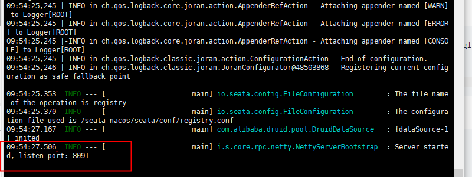
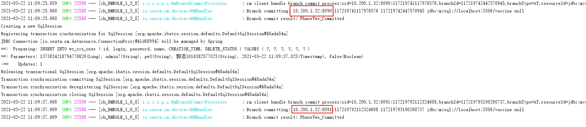
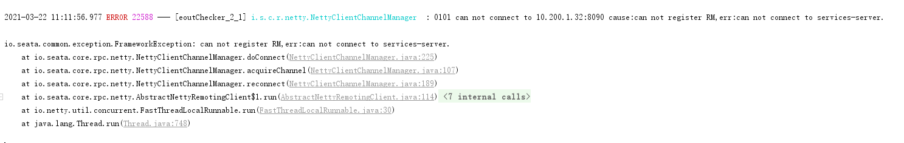

# 分布式事务（Seata1.4）

**这里都已1.4版本为例。**

## seata+nacos部署安装

[seata官方文档](http://seata.io/zh-cn/docs/overview/what-is-seata.html)

前提：[nacos](https://nacos.io/zh-cn/docs/quick-start.html) 安装成功。

### seata服务启动

下载[seata-server1.4.0](https://github.com/seata/seata/releases)，已经下载好的 [seata-server-1.4.0.tar.gz](./wx-dynamic-seata-images/seata-server-1.4.0.tar.gz) 

在 linux 中解压，这里用db模式存储，建表语句[seata.sql](./wx-dynamic-seata-images/seata.sql)

```shell
tar -zxvf seata-server-1.4.0.tar.gz
#修改参数
cd seata/conf
#修改 file.conf: store.mode="db",db参数修改
vim file.conf
#修改 registry.conf: registry.type="nacos"、config.type="nacos"，对应nacos参数修改
vim registry.conf
#启动，后台启动
cd ../bin
./seata-server.sh -h 10.200.1.32 -p 8091 -m db -n 1 >nohup.out 2>1 &
 -h: 注册到注册中心的ip
 -p: Server rpc 监听端口
 -m: 全局事务会话信息存储模式，file、db、redis，优先读取启动参数 (Seata-Server 1.3及以上版本支持redis)
 -n: Server node，多个Server时，需区分各自节点，用于生成不同区间的transactionId，以免冲突
 -e: 多环境配置参考 http://seata.io/en-us/docs/ops/multi-configuration-isolation.html
```



### seata参数初始化到nacos

1. 下载执行脚本[nacos-config.sh](https://github.com/seata/seata/blob/1.4.0/script/config-center/nacos/nacos-config.sh)和初始化参数文本[config.txt](https://github.com/seata/seata/blob/1.4.0/script/config-center/config.txt)

   这里已经有下载好的[seata源码](./wx-dynamic-seata-images/seata-1.4.0.zip)

   [nacos-config.sh](./wx-dynamic-seata-images/nacos-config.sh)

   ```sh
   #!/usr/bin/env bash
   #-h: host，默认值 localhost
   #-p: port，默认值 8848
   #-g: 配置分组，默认值为 'SEATA_GROUP'
   #-t: 租户信息，对应 Nacos 的命名空间ID字段, 默认值为空 ''
   #-u: nacos账号
   #-w: nacos密码
   while getopts ":h:p:g:t:u:w:" opt
   do
     case $opt in
     h)
       host=$OPTARG
       ;;
     p)
       port=$OPTARG
       ;;
     g)
       group=$OPTARG
       ;;
     t)
       tenant=$OPTARG
       ;;
     u)
       username=$OPTARG
       ;;
     w)
       password=$OPTARG
       ;;
     ?)
       echo " USAGE OPTION: $0 [-h host] [-p port] [-g group] [-t tenant] [-u username] [-w password] "
       exit 1
       ;;
     esac
   done
   
   if [[ -z ${host} ]]; then
       host=localhost
   fi
   if [[ -z ${port} ]]; then
       port=8848
   fi
   if [[ -z ${group} ]]; then
       group="SEATA_GROUP"
   fi
   if [[ -z ${tenant} ]]; then
       tenant=""
   fi
   if [[ -z ${username} ]]; then
       username=""
   fi
   if [[ -z ${password} ]]; then
       password=""
   fi
   
   nacosAddr=$host:$port
   contentType="content-type:application/json;charset=UTF-8"
   
   echo "set nacosAddr=$nacosAddr"
   echo "set group=$group"
   
   failCount=0
   tempLog=$(mktemp -u)
   function addConfig() {
     curl -X POST -H "${contentType}" "http://$nacosAddr/nacos/v1/cs/configs?dataId=$1&group=$group&content=$2&tenant=$tenant&username=$username&password=$password" >"${tempLog}" 2>/dev/null
     if [[ -z $(cat "${tempLog}") ]]; then
       echo " Please check the cluster status. "
       exit 1
     fi
     if [[ $(cat "${tempLog}") =~ "true" ]]; then
       echo "Set $1=$2 successfully "
     else
       echo "Set $1=$2 failure "
       (( failCount++ ))
     fi
   }
   
   count=0
   for line in $(cat $(dirname "$PWD")/config.txt | sed s/[[:space:]]//g); do
     (( count++ ))
   	key=${line%%=*}
       value=${line#*=}
   	addConfig "${key}" "${value}"
   done
   
   echo "========================================================================="
   echo " Complete initialization parameters,  total-count:$count ,  failure-count:$failCount "
   echo "========================================================================="
   
   if [[ ${failCount} -eq 0 ]]; then
   	echo " Init nacos config finished, please start seata-server. "
   else
   	echo " init nacos config fail. "
   fi
   ```

   [config.txt](./wx-dynamic-seata-images/config.txt)

   参考：https://seata.io/zh-cn/docs/user/configurations.html

   #### TC (Transaction Coordinator) - 事务协调者

   维护全局和分支事务的状态，驱动全局事务提交或回滚。

   #### TM (Transaction Manager) - 事务管理器

   定义全局事务的范围：开始全局事务、提交或回滚全局事务。

   #### RM (Resource Manager) - 资源管理器

   管理分支事务处理的资源，与TC交谈以注册分支事务和报告分支事务的状态，并驱动分支事务提交或回滚。

   ```properties
   #transport 这里都是默认值
   #io.seata.spring.boot.autoconfigure.properties.client.TransportProperties
   #io.seata.spring.boot.autoconfigure.properties.client.ShutdownProperties
   #io.seata.spring.boot.autoconfigure.properties.client.ThreadFactoryProperties
   transport.type=TCP
   transport.server=NIO
   transport.heartbeat=true
   transport.serialization=seata
   transport.compressor=none
   transport.enableClientBatchSendRequest=false
   transport.threadFactory.bossThreadPrefix=NettyBoss
   transport.threadFactory.workerThreadPrefix=NettyServerNIOWorker
   transport.threadFactory.serverExecutorThreadPrefix=NettyServerBizHandler
   transport.threadFactory.shareBossWorker=false
   transport.threadFactory.clientSelectorThreadPrefix=NettyClientSelector
   transport.threadFactory.clientSelectorThreadSize=1
   transport.threadFactory.clientWorkerThreadPrefix=NettyClientWorkerThread
   transport.threadFactory.bossThreadSize=1
   transport.threadFactory.workerThreadSize=default
   transport.shutdown.wait=3
   #客户端参数
   #事务群组，每一个微服务都需要注册
   service.vgroupMapping.my_test_tx_group=wx-seata
   #TC服务列表
   service.wx-seata.grouplist=127.0.0.1:8091
   service.enableDegrade=false
   service.disableGlobalTransaction=false
   client.rm.asyncCommitBufferLimit=10000
   client.rm.lock.retryInterval=10
   client.rm.lock.retryTimes=30
   client.rm.lock.retryPolicyBranchRollbackOnConflict=true
   client.rm.reportRetryCount=5
   client.rm.tableMetaCheckEnable=false
   client.rm.sqlParserType=druid
   client.rm.reportSuccessEnable=false
   client.rm.sagaBranchRegisterEnable=false
   client.tm.commitRetryCount=5
   client.tm.rollbackRetryCount=5
   client.tm.defaultGlobalTransactionTimeout=60000
   client.tm.degradeCheck=false
   client.tm.degradeCheckAllowTimes=10
   client.tm.degradeCheckPeriod=2000
   store.mode=db
   store.db.datasource=druid
   store.db.dbType=mysql
   store.db.driverClassName=com.mysql.jdbc.Driver
   store.db.url=jdbc:mysql://127.0.0.1:3306/seata?useUnicode=true
   store.db.user=username
   store.db.password=password
   store.db.minConn=5
   store.db.maxConn=30
   store.db.globalTable=global_table
   store.db.branchTable=branch_table
   store.db.queryLimit=100
   store.db.lockTable=lock_table
   store.db.maxWait=5000
   server.recovery.committingRetryPeriod=1000
   server.recovery.asynCommittingRetryPeriod=1000
   server.recovery.rollbackingRetryPeriod=1000
   server.recovery.timeoutRetryPeriod=1000
   server.maxCommitRetryTimeout=-1
   server.maxRollbackRetryTimeout=-1
   server.rollbackRetryTimeoutUnlockEnable=false
   client.undo.dataValidation=true
   client.undo.logSerialization=jackson
   client.undo.onlyCareUpdateColumns=true
   server.undo.logSaveDays=7
   server.undo.logDeletePeriod=86400000
   client.undo.logTable=undo_log
   client.log.exceptionRate=100
   metrics.enabled=false
   metrics.registryType=compact
   metrics.exporterList=prometheus
   metrics.exporterPrometheusPort=9898
   
   ```

   

2. 

   

## seata+dynamic-datasource 集成

[seata+dynamic-datasource官方文档](https://dynamic-datasource.com/guide/tx/Seata.html)


## seata集群

seata集群配置，看到切换



取消其中一个

